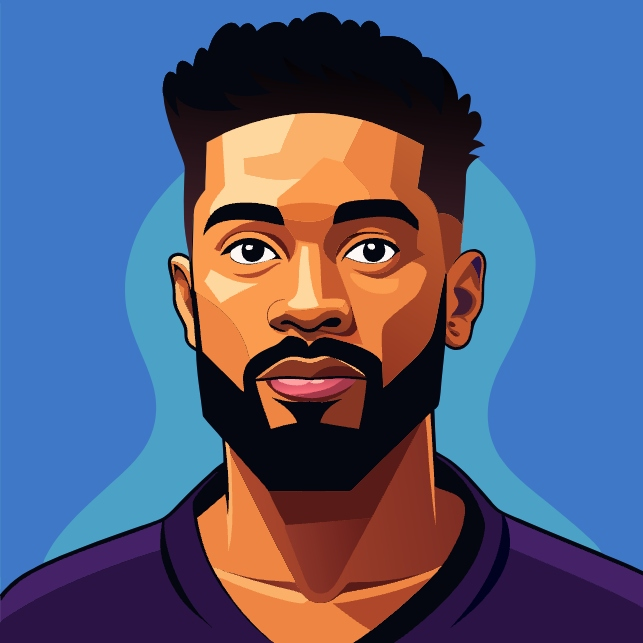

# Personal Portfolio Website - Gustave Rumongi

## 📁 Repository
[GitHub Repository](https://github.com/grumongi/portfolio-website)

## 📸 Screenshot


## 📋 Project Description

This is a personal portfolio website for Gustave Rumongi, a web developer from Phoenix, Arizona. The website serves as a professional showcase of skills, projects, and contact information. It features a clean, responsive design that highlights the developer's work and provides an easy way for potential clients and employers to get in touch.

### 🎯 Objectives
- Create a professional online presence
- Showcase web development skills and projects
- Provide easy contact and networking opportunities
- Demonstrate responsive web design capabilities
- Implement accessibility best practices

## ✨ Key Features

- **Responsive Design**: Optimized for desktop, tablet, and mobile devices
- **Accessible Navigation**: ARIA roles and semantic HTML for screen readers
- **Professional Branding**: Custom logo and consistent color scheme
- **Social Media Integration**: Links to Twitter, LinkedIn, and GitHub
- **Contact Information**: Easy access to professional contact details
- **Project Portfolio**: Dedicated section for showcasing work
- **Clean Typography**: Custom fonts from Google Fonts (Afacad Flux)

## 🛠 Technologies Used

### Frontend
- **HTML5**: Semantic markup and structure
- **CSS3**: Styling and responsive layout
- **JavaScript**: Interactive functionality

### Tools & Libraries
- **Normalize.css**: Cross-browser CSS consistency
- **Google Fonts**: Typography (Afacad Flux font family)
- **tota11y**: Accessibility testing and validation
- **Custom CSS**: Responsive design and animations

### Assets
- **Custom Logo**: Professional branding with GR initials
- **SVG Icons**: Scalable social media icons
- **Favicon**: Browser tab identification
- **Profile Images**: Professional photography

## 📂 Project Structure

```
Portfolio-project/
├── index.html                    # Homepage
├── About G.Rumongi.html         # About page
├── Gustave Rumongi Contact.html # Contact page
├── work.html                    # Portfolio/work page
├── Meet.App.Details.html        # Project details page
├── CSS/
│   ├── style.production.css     # Production styles
│   └── Styles.css              # Development styles
├── img/
│   ├── logo-with-gr.png        # Main logo
│   ├── gr-img.jpg              # Profile image
│   ├── favicon.123.ico         # Browser favicon
│   ├── twiter icon.svg         # Twitter icon
│   ├── linkedin.svg            # LinkedIn icon
│   └── github_icon.svg         # GitHub icon
└── js/
    └── tota11y.min.js          # Accessibility testing tool
```

## 🎨 Design Features

### Color Scheme
- **Primary Green**: `#357b70` - Main brand color
- **Secondary Gold**: `#e0b354` - Accent color
- **Dark Grey**: `#2b2b2b` - Text and contrast

### Typography
- **Font Family**: Afacad Flux (Google Fonts)
- **Font Weights**: 400-700 range for flexible styling
- **Responsive Text**: Scalable across different screen sizes

### Layout
- **Flexbox Navigation**: Right-aligned menu items
- **Grid System**: Organized content sections
- **Mobile-First**: Responsive design approach

## 🚀 Getting Started

### Prerequisites
- Modern web browser
- Text editor (VS Code recommended)
- Local server (optional for development)

### Installation

1. **Clone the repository**
   ```bash
   git clone https://github.com/grumongi/portfolio-website
   ```

2. **Navigate to project directory**
   ```bash
   cd portfolio-project
   ```

3. **Open in browser**
   - Double-click `index.html` to open in browser
   - Or use a local server for development

### Development Setup

1. **Install Live Server extension** (VS Code)
2. **Right-click on index.html** → "Open with Live Server"
3. **Make changes** and see them update automatically

## 📱 Responsive Breakpoints

- **Mobile**: `max-width: 500px`
- **Tablet**: `500px - 750px`
- **Desktop**: `min-width: 750px`

## ♿ Accessibility Features

- ARIA roles for navigation elements
- Semantic HTML structure
- Alt text for all images
- Keyboard navigation support
- Screen reader compatibility
- Color contrast compliance

## 🔧 Browser Support

- Chrome (latest)
- Firefox (latest)  
- Safari (latest)
- Edge (latest)
- Internet Explorer 11+

## 📈 Performance Optimizations

- Optimized images
- Minified CSS in production
- External font loading optimization
- Efficient CSS selectors

## 🤝 Contributing

1. Fork the repository
2. Create a feature branch (`git checkout -b feature/AmazingFeature`)
3. Commit changes (`git commit -m 'Add some AmazingFeature'`)
4. Push to branch (`git push origin feature/AmazingFeature`)
5. Open a Pull Request

## 📄 License

This project is licensed under the MIT License - see the [LICENSE.md](LICENSE.md) file for details.

## 📞 Contact

**Gustave Rumongi**
-GitHub: [grumongi](https://github.com/grumongi)

## Acknowledgments

- Google Fonts for typography
- Normalize.css for cross-browser compatibility
- tota11y for accessibility testing
- Icons and images used in the project

